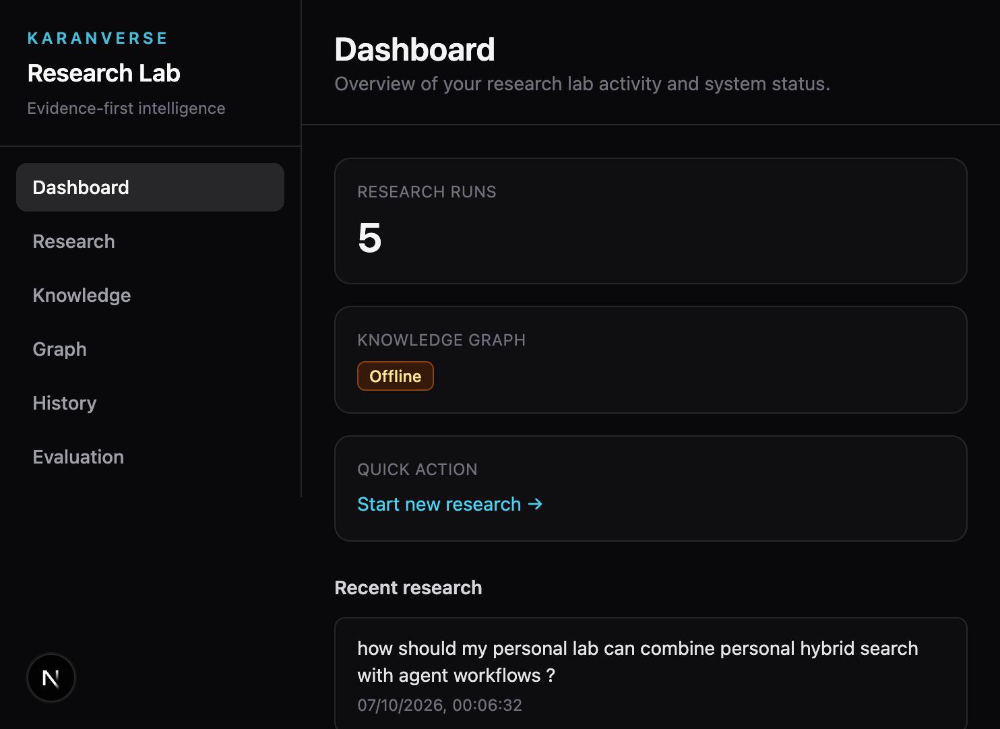
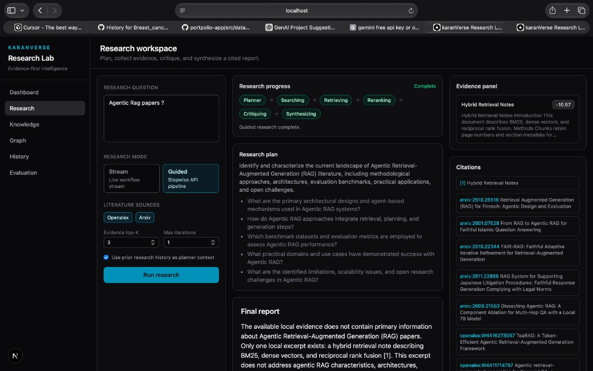
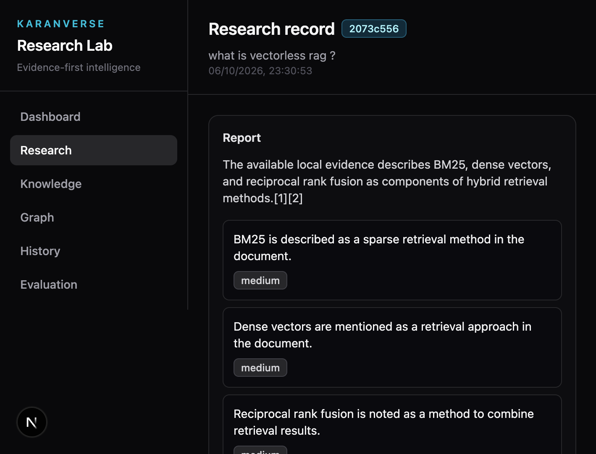
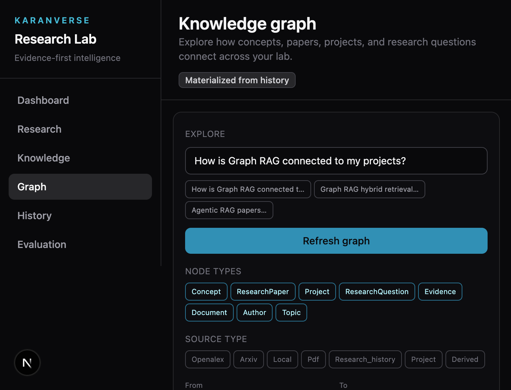
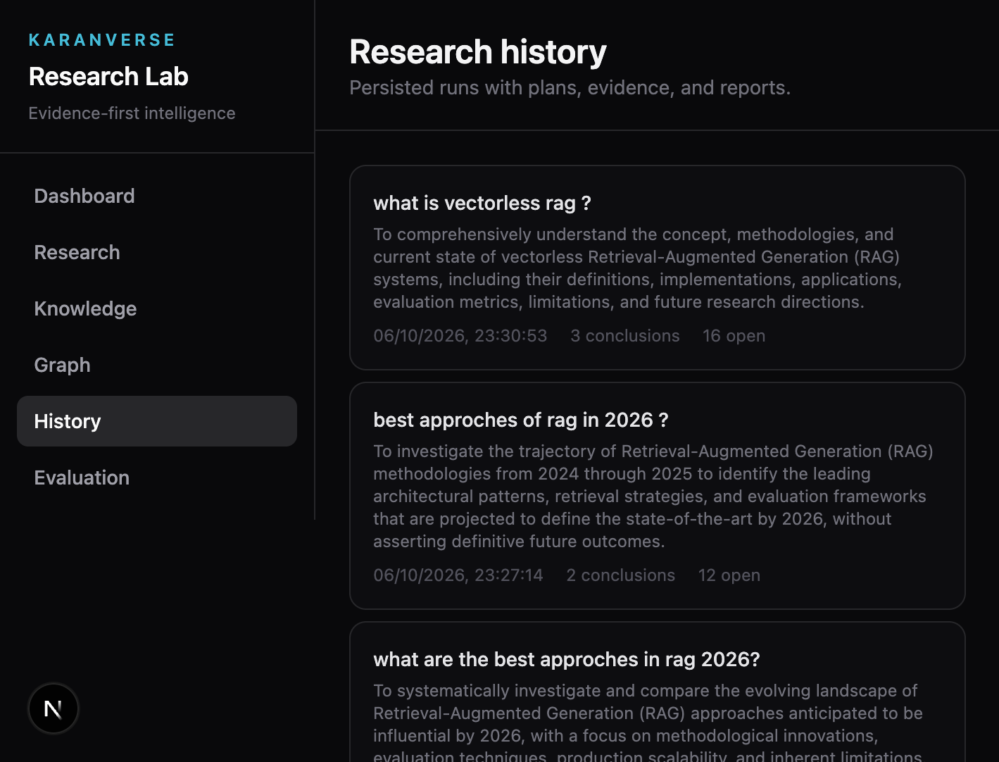
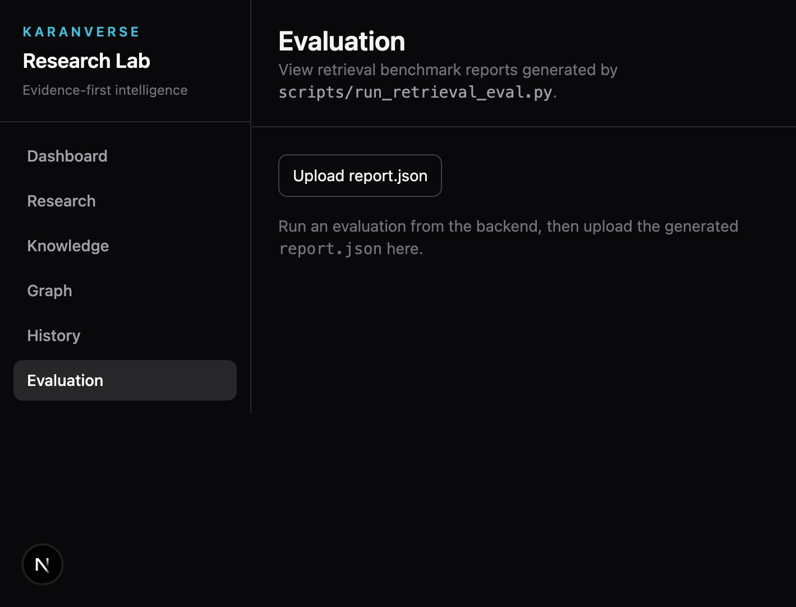

# karanVerse — Personal AI Research Lab

Personal research intelligence platform for ingesting documents, hybrid retrieval, external literature search, knowledge graphs, and cited research reports.

**Current milestone:** FastAPI research backend (agents, retrieval, history, gaps, evaluation) plus a Next.js research dashboard in `frontend/`.

## What is this project?

**karanVerse Research Lab** is a personal, evidence-first research stack: you ask a question, the system **plans** how to investigate it, **searches** your indexed documents and public literature (OpenAlex, arXiv), **retrieves and reranks** chunks with hybrid BM25 + dense retrieval, **critiques** whether evidence is sufficient, and **synthesizes** a structured report with inline citations. Every major step is observable (optional Langfuse), persisted (research history on disk), and testable (pytest + retrieval evaluation scripts).

It is designed for a single researcher or small lab—not multi-tenant SaaS—running locally or via Docker, with clear boundaries between **public research corpus**, **personal notes**, and **project documentation**.

**Intended user and demo narrative:** Karan Bhosle (Data Scientist)—hybrid retrieval, agentic RAG, MCP, and this repo as the flagship **karanVerse Research Lab** project. Seed data and screenshot guidance: [`docs/VISION_AND_DEMO.md`](docs/VISION_AND_DEMO.md).

### Problems it solves

| Problem | How the lab addresses it |
|--------|-------------------------|
| Scattered PDFs and notes | Ingest PDFs and text into `data/processed/` with scope tags (`PUBLIC_RESEARCH`, `PERSONAL_KNOWLEDGE`, `PROJECT`) |
| Shallow “chat with PDF” answers | Grounded RAG and full **research workflow** with numbered evidence and citation labels `[1]`, `[2]` |
| Literature vs local knowledge | Planner + source search hit **arXiv/OpenAlex**; retrieval hits **your index**; scopes control what is searched |
| Repeated research on similar topics | **Research history** feeds the planner (snippets only, not full reports) and supports **research update** diffs |
| “What don’t I know?” | **Knowledge gap** analysis over history + scoped corpora |
| Retrieval quality | **Evaluation framework** (BM25, dense, hybrid, rerank, agentic) with standard IR metrics |
| Trust and safety | Private knowledge is **not** sent to external LLMs or literature APIs unless you opt in via env + API flags |

### End-to-end research workflow (backend)

```text
User question
    → load prior research context (optional)
    → planner (LLM): objective, sub-questions, search queries, sources
    → literature search (OpenAlex / arXiv)
    → hybrid retrieval + reranking on local chunks
    → critic (LLM): gaps, conflicts, more search?
    → [loop if insufficient]
    → synthesizer (LLM): executive summary, findings, citations
    → save to data/research_history/{id}.json
```

The same capabilities are exposed as **REST** (`/research`, `/research/stream` SSE) and as **granular endpoints** (plan, collect, critique, synthesize) for debugging.

### Major components

- **`backend/app/api/`** — FastAPI routes (documents, search, knowledge, research, health, LLM config).
- **`backend/app/agents/`** — LangGraph workflows: planner, research agent, critic, synthesizer, knowledge gap, research update.
- **`backend/app/retrieval/`** — BM25 index, Qdrant vectors, hybrid RRF, cross-encoder rerank, knowledge-scope filters.
- **`backend/app/sources/`** — OpenAlex and arXiv clients with caching and SSRF-safe base URLs.
- **`backend/app/security/`** — Upload limits, path safety, optional API key auth, private-knowledge guards for external LLMs.
- **`frontend/`** — Next.js dashboard: research workspace with live progress, knowledge search, graph explorer, history, evaluation upload.
- **`data/`** — Raw uploads, processed chunks, BM25 index, research history, evaluation datasets (gitignored contents).
- **`scripts/run_retrieval_eval.py`** — Batch retrieval benchmarks; reports can be viewed in the Evaluation UI.

### What you need running (minimal vs full)

| Capability | Required | Optional |
|------------|----------|----------|
| API + UI | Python 3.12, `.env` with LLM key | — |
| Hybrid / knowledge search | Processed documents (ingest PDF/text) | Qdrant (`docker compose up -d qdrant`) for dense vectors |
| Knowledge graph UI | — | Neo4j + `NEO4J_ENABLED=true` |
| Tracing | — | Langfuse keys + `LANGFUSE_ENABLED=true` |

## UI tour (screenshots)

Screenshots live in [`docs/screenshots/`](docs/screenshots/). They are meant to show **real demo data** for this lab—profile and learning notes from [`data/personal/portfolio_seed.json`](data/personal/portfolio_seed.json), plus your saved research runs—not empty placeholders.

**Who it’s for and how to refresh data:** see [`docs/VISION_AND_DEMO.md`](docs/VISION_AND_DEMO.md). Run `./scripts/seed_demo_data.sh` before capturing; you can **edit or replace** any PNG in `docs/screenshots/` (keep filenames) or regenerate from `npm run dev` on port 3000.

### Dashboard

Overview of research run count, graph status, quick link to start research, and **recent history** from `data/research_history/`.



### Research workspace

Ask a lab-aligned question (e.g. hybrid retrieval + agentic workflows), choose **stream** or **guided** mode, then run planner → literature search → hybrid retrieval → critic → synthesizer.



### Research record (history detail)

A saved run’s executive summary, findings, evidence excerpts, and open questions.



### Knowledge

Scoped search over **personal notes and project docs** (portfolio seed) and public corpus. Example: *What have I learned about Graph RAG?* infers personal/project scopes and surfaces learning notes from the seed.

### Graph

Force-directed view from research history + ingested chunks (filters by node type and source). Neo4j is optional.



### History

All persisted runs with objectives, timestamps, and links to full reports.



### Evaluation

Upload `report.json` from `scripts/run_retrieval_eval.py` to compare BM25, dense, hybrid, rerank, and agentic metrics.



## Repository layout

```
├── backend/          # FastAPI application
├── frontend/         # Next.js research dashboard
├── data/             # raw, processed, research artifacts
├── notebooks/        # exploratory work
├── docs/             # documentation
├── scripts/          # operational scripts
└── docker/           # container definitions
```

## Prerequisites

- Python 3.12+
- Docker & Docker Compose (optional, for containerized runs)

## Local setup

1. Clone the repository and enter the project root.

2. Copy environment template:

   ```bash
   cp .env.example .env
   ```

3. Create a virtual environment and install backend dependencies:

   ```bash
   cd backend
   python3.12 -m venv .venv
   source .venv/bin/activate
   pip install -r requirements.txt
   ```

4. Run tests:

   ```bash
   pytest
   ```

5. Start the API:

   ```bash
   uvicorn app.main:app --reload --host 0.0.0.0 --port 8000
   ```

6. Start the frontend (separate terminal):

   ```bash
   cd frontend
   cp .env.local.example .env.local
   npm install
   npm run dev
   ```

   Open [http://localhost:3000](http://localhost:3000) for `/dashboard`, `/research`, `/knowledge`, `/history`, `/evaluation`, and `/graph`.

7. Verify health:

   ```bash
   curl http://localhost:8000/health
   ```

   Expected JSON shape: `{"status":"ok","service":"...","environment":"..."}`

Interactive API docs: [http://localhost:8000/docs](http://localhost:8000/docs)

### Ingest a PDF

```bash
curl -X POST "http://localhost:8000/documents/ingest" \
  -H "accept: application/json" \
  -H "Content-Type: multipart/form-data" \
  -F "file=@backend/tests/fixtures/sample_research.pdf"
```

### BM25 search

Indexes are persisted under `data/index/bm25/` and rebuilt automatically when processed chunks change.

```bash
curl -X POST "http://localhost:8000/search/bm25" \
  -H "Content-Type: application/json" \
  -d '{"query": "bm25 hybrid retrieval", "top_k": 5}'
```

### Qdrant + vector search

Start Qdrant (and API) with Docker Compose:

```bash
docker compose up -d qdrant
```

Optional Neo4j knowledge graph:

```bash
docker compose up -d neo4j
```

Set `NEO4J_ENABLED=true` and `NEO4J_PASSWORD` in `.env`. The API remains usable if Neo4j is down; graph calls degrade to no-ops / empty results.

Ingested PDF chunks are embedded with `sentence-transformers` and upserted into Qdrant automatically.

```bash
curl -X POST "http://localhost:8000/search/vector" \
  -H "Content-Type: application/json" \
  -d '{"query": "hybrid retrieval methods", "top_k": 5}'
```

Configure via `.env`: `EMBEDDING_MODEL`, `QDRANT_COLLECTION`, `VECTOR_DIMENSION`, `VECTOR_SEARCH_TOP_K`, `QDRANT_URL`.

### Hybrid search (BM25 + vector + RRF)

```bash
curl -X POST "http://localhost:8000/search/hybrid" \
  -H "Content-Type: application/json" \
  -d '{"query": "hybrid retrieval fusion", "top_k": 5}'
```

RRF settings: `RRF_K`, `HYBRID_BM25_WEIGHT`, `HYBRID_VECTOR_WEIGHT`, `HYBRID_CANDIDATE_POOL`.

### Hybrid + cross-encoder rerank

```bash
curl -X POST "http://localhost:8000/search/hybrid/rerank" \
  -H "Content-Type: application/json" \
  -d '{"query": "hybrid retrieval fusion", "final_top_k": 5, "candidate_count": 30}'
```

Reranker settings: `RERANKER_MODEL`, `RERANK_CANDIDATE_COUNT`, `RERANK_FINAL_TOP_K`.

### Retrieval evaluation framework

Compare **BM25**, **dense**, **hybrid RRF**, **hybrid + reranker**, and **agentic** (multi sub-query) retrieval on a labeled dataset with Recall@K, Precision@K, MRR, nDCG, and latency. Optional answer metrics: faithfulness, relevance, citation correctness/completeness.

Dataset format (`data/evaluation/README.md`): `question`, `expected_sources`, `expected_evidence` (chunk IDs), `reference_answer`, optional `retrieval_sub_queries`.

```bash
cd backend
python ../scripts/run_retrieval_eval.py \
  --dataset ../data/evaluation/sample_dataset.json \
  --output ../data/evaluation/reports/latest \
  --k 1 3 5 10 \
  --seed 42
```

Label chunk IDs with `python ../scripts/list_eval_chunk_ids.py --query "hybrid retrieval"`.

### LLM provider abstraction

Configure via **local `.env`** (never commit secrets). Default provider is **OpenRouter**: `OPENROUTER_API_KEY`, `OPENROUTER_MODEL`, optional `OPENROUTER_BASE_URL` (defaults to `https://openrouter.ai/api/v1`). OmniRouter/Gemini/Ollama remain available via `LLM_PROVIDER`.

```bash
curl http://localhost:8000/llm/config
```

Alternatives: `LLM_PROVIDER=gemini` (`GEMINI_API_KEY`) or `LLM_PROVIDER=ollama`.

### External literature search (OpenAlex, arXiv)

Sources are registered in `SourceRegistry` (`openalex`, `arxiv`). Pass `source` in the request body:

```bash
curl -X POST "http://localhost:8000/research/search" \
  -H "Content-Type: application/json" \
  -d '{"query": "hybrid retrieval reciprocal rank fusion", "limit": 10, "source": "openalex"}'
```

```bash
curl -X POST "http://localhost:8000/research/search" \
  -H "Content-Type: application/json" \
  -d '{"query": "dense passage retrieval", "limit": 10, "source": "arxiv"}'
```

Returns normalized `ResearchPaper` metadata (authors, categories/concepts, publication dates, PDF URLs for arXiv). Does not auto-download or ingest PDFs.

### Personal knowledge (scoped retrieval)

Chunks are tagged with `knowledge_scope`: `PUBLIC_RESEARCH`, `PERSONAL_KNOWLEDGE`, `PROJECT`, `WEB`.  
By default, generic queries search **public research only**; personal phrasing (e.g. “my projects”, “I learned”) searches personal/project corpora without mixing unless `allow_mixed_sources=true`.

```bash
# Import portfolio seed (from data/personal/portfolio_seed.json)
curl -X POST "http://localhost:8000/knowledge/import/portfolio"

# Scoped personal/project search
curl -X POST "http://localhost:8000/knowledge/search" \
  -H "Content-Type: application/json" \
  -d '{"query": "What have I previously learned about Graph RAG?"}'

# Ingest a markdown/text note
curl -X POST "http://localhost:8000/knowledge/ingest/text" \
  -H "Content-Type: application/json" \
  -d '{"title": "MCP notes", "text": "# MCP\n...", "knowledge_scope": "PERSONAL_KNOWLEDGE", "document_kind": "technical_note"}'
```

PDF ingest accepts optional `knowledge_scope` / `document_kind` form fields on `POST /documents/ingest`.

### Knowledge gap detection

`POST /knowledge/gaps` analyzes **your** research history plus personal/project/public indexed knowledge (not generic LLM knowledge). Returns `KnowledgeGap` items with topic, reason, related concepts, supporting research runs, recommended learning, and priority.

```bash
curl -X POST "http://localhost:8000/knowledge/gaps" \
  -H "Content-Type: application/json" \
  -d '{"query": "What don'\''t I know about Agentic RAG?"}'
```

Signals include weak coverage, missing prerequisites (unresolved questions), conflicts from prior critiques, frequently revisited topics, low-evidence runs, and project-linked shallow understanding.

### Knowledge graph visualization

The `/graph` page renders an interactive force-directed view (zoom, pan, node selection) built from research history and indexed documents. Filter by node type, source type, and date. Click a node to see supporting papers, evidence excerpts, and linked research runs.

API: `POST /knowledge/graph/query`, `GET /knowledge/graph/node/{id}`.

### End-to-end research workflow

`POST /research` runs the full LangGraph pipeline (load prior research context → planner → source search → retrieval → rerank → critic → optional additional research loop → synthesizer), persists a history record, and returns `research_id`, `report`, and `history_context_used` (retrieved snippets only—not full past reports).

`GET /research/history` lists past runs; `GET /research/{research_id}` returns the full stored record (plan, sources, evidence, report, citations, conclusions, unresolved questions).

### Research update (what changed since a prior run)

`POST /research/update` compares a stored research record against fresh literature search and local retrieval, then returns a `ResearchUpdate` (changed vs unchanged claims, contradictions, newly discovered and outdated information, confidence, and recommended next action).

```bash
curl -X POST "http://localhost:8000/research/update" \
  -H "Content-Type: application/json" \
  -d '{"research_id": "<uuid-from-post-research>", "question": "Research this topic again and tell me what changed."}'
```

You can omit `research_id` and pass only `question`; the service resolves the best matching prior run from research history.

```bash
curl -X POST "http://localhost:8000/research" \
  -H "Content-Type: application/json" \
  -d '{"question": "What are the best approaches for Agentic RAG in 2026?", "max_iterations": 2}'
```

### Research planner (LangGraph agent)

Produces a structured `ResearchPlan` from a complex question. The planner does **not** answer the question.

```bash
curl -X POST "http://localhost:8000/research/plan" \
  -H "Content-Type: application/json" \
  -d '{"question": "What are the best approaches for Agentic RAG in 2026?"}'
```

Response includes `research_objective`, `sub_questions`, `search_queries`, `required_sources` (from `SourceRegistry`), `expected_evidence`, and `research_strategy`.

### Research agent (evidence collection, no synthesis)

LangGraph pipeline: planner → sub-questions → OpenAlex/arXiv search → document retrieval → hybrid retrieval → reranking → `ResearchEvidenceBundle`.

```bash
curl -X POST "http://localhost:8000/research/collect" \
  -H "Content-Type: application/json" \
  -d '{"question": "What are the best approaches for Agentic RAG in 2026?", "evidence_top_k": 5}'
```

Returns `papers`, local corpus `evidence` / `citations`, `retrieval_scores`, `source_metadata`, and `unresolved_questions`. Does **not** generate a final answer (use `/research/answer` for synthesis).

### Critic agent (evidence critique, no synthesis)

Evaluates a `ResearchEvidenceBundle` (deterministic checks + structured LLM). Does not invent evidence; invalid `evidence_id` references are dropped.

```bash
curl -X POST "http://localhost:8000/research/critique" \
  -H "Content-Type: application/json" \
  -d @evidence_bundle.json
```

Returns `CritiqueResult` with sufficiency, source quality notes, conflicts, gaps, duplicate groups, and `additional_research_queries` when more research is needed.

### Research synthesizer (grounded report)

Combines question, plan, evidence bundle, and critic output into a `ResearchReport` (executive summary, findings, evidence, contradictions, limitations, recommendations, open questions, references). Factual claims must cite local evidence labels (`[1]`, …); invalid evidence IDs are stripped.

```bash
curl -X POST "http://localhost:8000/research/synthesize" \
  -H "Content-Type: application/json" \
  -d @synthesize_request.json
```

### Grounded research answer (baseline RAG)

```bash
curl -X POST "http://localhost:8000/research/answer" \
  -H "Content-Type: application/json" \
  -d '{"question": "How does hybrid retrieval work?", "top_k": 5}'
```

Pipeline: hybrid retrieval → cross-encoder rerank → evidence context → grounded LLM answer with `[1]` style citations.

### Evidence and citations

Retrieval hits can be registered as numbered evidence (`[1]`, `[2]`, …) via `CitationService`, with resolution back to processed chunks under `data/processed/`.

### Retrieval comparison report

```bash
cd backend
python ../scripts/compare_retrieval.py --output ../data/research/retrieval_comparison.md
```

Processed output is written to `data/processed/<document_id>/`:

- `document.json` — normalized document (title, blocks, metadata)
- `chunks.json` — chunks with provenance (`document_id`, `filename`, `page_number`, `section`, `chunk_id`, `source_type`, `ingestion_timestamp`)
- `content.md` — Docling markdown export

## Docker

From the project root (ensure `.env` exists):

```bash
docker compose up --build
```

Health: `http://localhost:8000/health`

### Security defaults

- **Private knowledge isolation:** Research retrieval defaults to `PUBLIC_RESEARCH` only. Client opt-in (`allow_private_knowledge` on workflow/RAG/gap requests) plus `RESEARCH_ALLOW_PRIVATE_KNOWLEDGE=true` is required to search personal/project corpora during research.
- **External LLMs:** Private/project excerpts are stripped from critic, synthesizer, RAG, gap, and planner history context unless both the client opts in and `EXTERNAL_LLM_ALLOW_PRIVATE_KNOWLEDGE=true` (local Ollama can use private data when the research flag is enabled).
- **Literature APIs:** Search queries are sanitized (single-line, length-capped) before arXiv/OpenAlex calls; API base URLs are restricted to known hosts.
- **Uploads:** PDF magic-byte check, size limits, and page caps; text ingest length limits; path traversal checks on stored ids.
- **Optional API auth:** Set `API_AUTH_ENABLED=true` and `API_KEY` for shared deployments (`/health` stays public).

### Langfuse observability (optional)

When `LANGFUSE_ENABLED=true` and `LANGFUSE_PUBLIC_KEY` / `LANGFUSE_SECRET_KEY` are set, research runs emit a Langfuse trace for the user question, workflow nodes (planner, source search, retrieval, reranking, critic, synthesis), and LLM generations (latency and token usage when the provider returns it). Metadata includes `research_id`, `agent_name`, `source`, and `retrieval_method` where applicable.

If Langfuse is disabled or credentials are missing, the API runs normally with a no-op observability backend. Check `GET /health` for `langfuse_enabled`, `langfuse_configured`, and `langfuse_active`.

## Configuration

Settings use Pydantic Settings and read from environment variables (see `.env.example`):

| Variable     | Default                  | Description        |
|-------------|--------------------------|--------------------|
| `APP_NAME`  | karanVerse Research Lab  | Service name       |
| `APP_ENV`   | development              | Environment label  |
| `APP_DEBUG` | false                    | FastAPI debug mode |
| `API_HOST`  | 0.0.0.0                  | Bind host          |
| `API_PORT`  | 8000                     | Bind port          |
| `LOG_LEVEL` | INFO                     | Logging level      |
| `LANGFUSE_ENABLED` | false              | Turn on Langfuse tracing |
| `LANGFUSE_PUBLIC_KEY` | (unset)         | Langfuse project public key |
| `LANGFUSE_SECRET_KEY` | (unset)         | Langfuse project secret key |
| `LANGFUSE_HOST` | https://cloud.langfuse.com | Langfuse API host |

## License

This project is licensed under the [MIT License](LICENSE).
